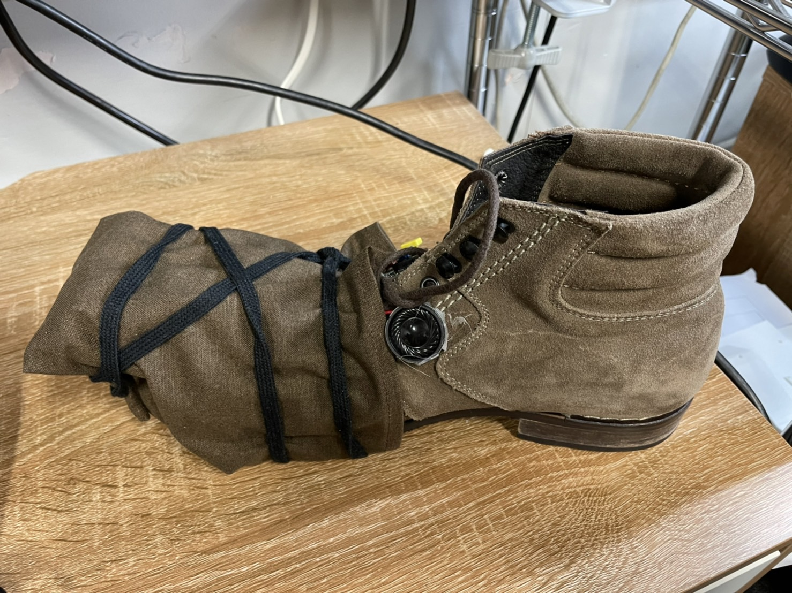
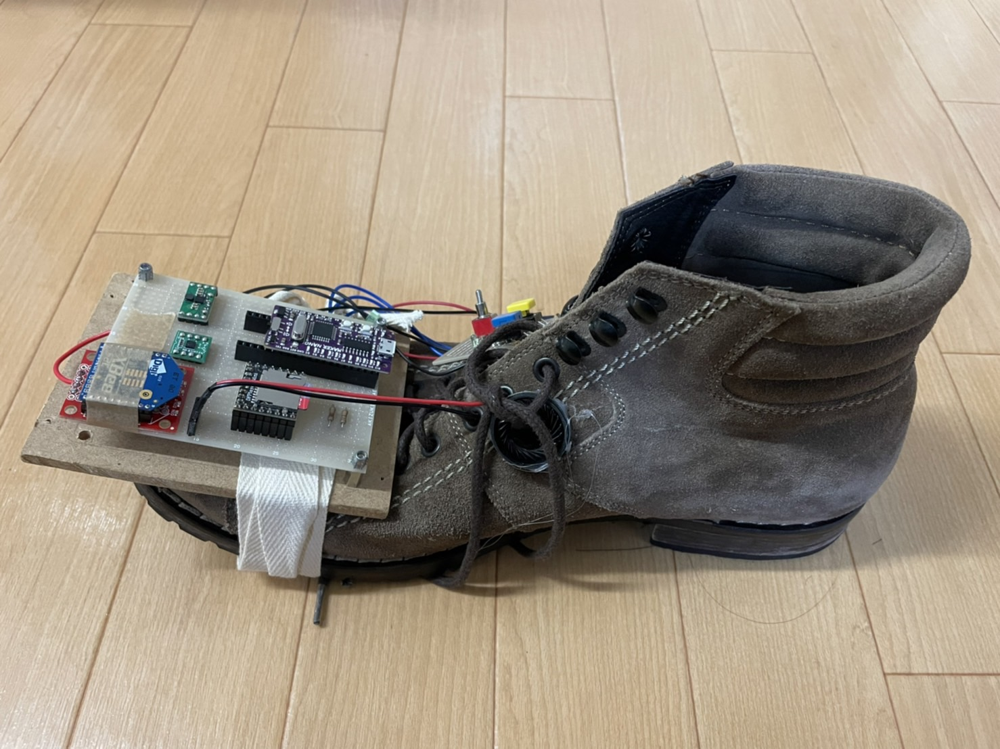

# PowerShooter

## ゲーム画面

## コントローラー

## プレイ動画
- ファイル内にある[Power Shooter.mp4]を参照ください。

# ゲーム概要
- タイトル：PowerShooter
- ジャンル：体験型サッカーゲーム
- 制作人数：一人
- 制作期間：二か月
- 開発環境：Unity
- ゲーム概要：
  - 靴型のコントローラーで実際に蹴る動作をしてボールをシュートするPKゲームです。
  - コントローラーに三軸加速度センサーが搭載されており、実際に蹴った角度やスピードを検知してゲーム内のボールのシュートにも反映するようになっています。

