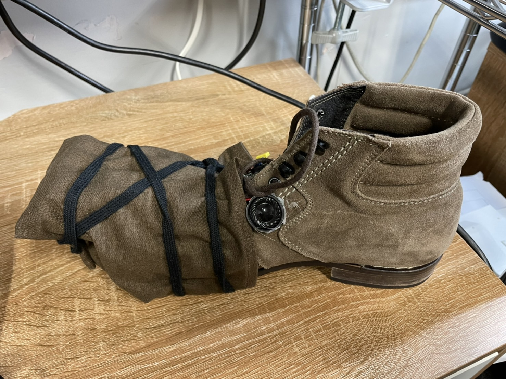
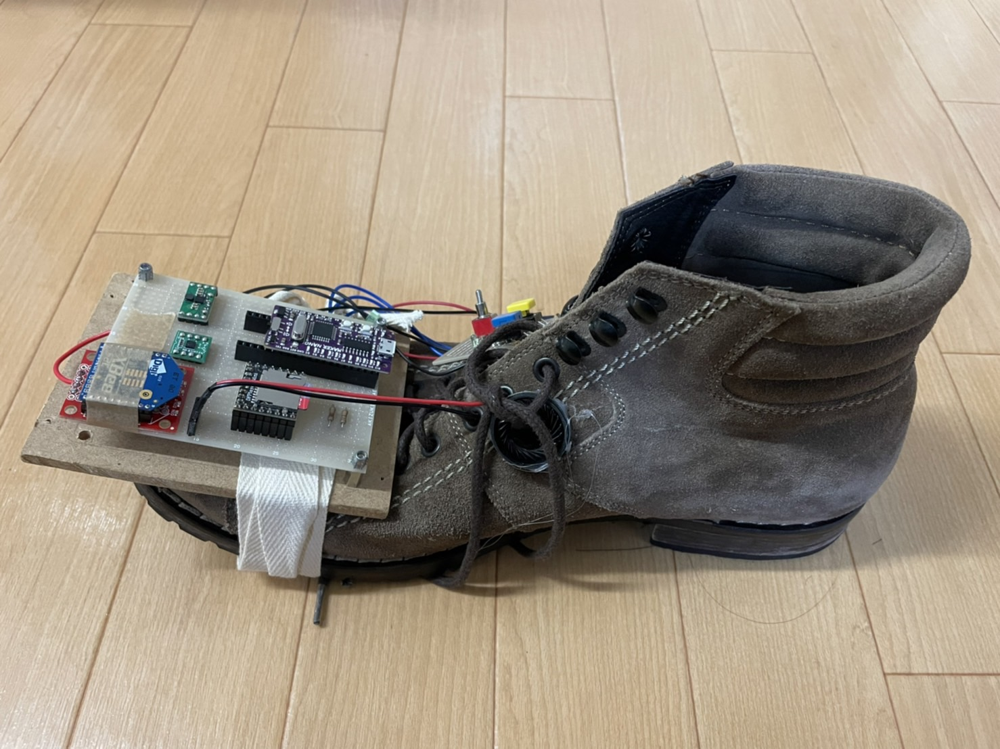

# PowerShooter

## ゲーム画面

## コントローラー

## プレイ動画
- movieファイル内にある[Power Shooter.mp4]を参照ください。

# ゲーム概要
- タイトル：PowerShooter
- ジャンル：体験型サッカーゲーム
- 制作人数：一人
- 制作期間：二か月
- 開発環境：Unity
- ゲーム概要：
  -  靴型のコントローラーで実際に蹴って、ゲーム内でボールをサッカーゴールにシュートするPKゲームです。靴型のコントローラーを装着して蹴る動作をすると、ゲーム内でも蹴った動きが反映されボールがシュートされます。
  - コントローラー自身に三軸加速度センサーが搭載されており、コントローラーで実際に蹴った角度やスピードを検知して、ゲーム内のボールのシュートのパワーや方向に反映するようになっています。
  - コントローラーに「Arduino Nano」というマイコンを搭載しており、マイコンから受け取った値をシリアル通信でUnity側に出力することで、蹴る動作による操作を可能にしています。 

## ソースコード
- PowerShooter/Assets/Scriptsファイル内からご参照ください。

